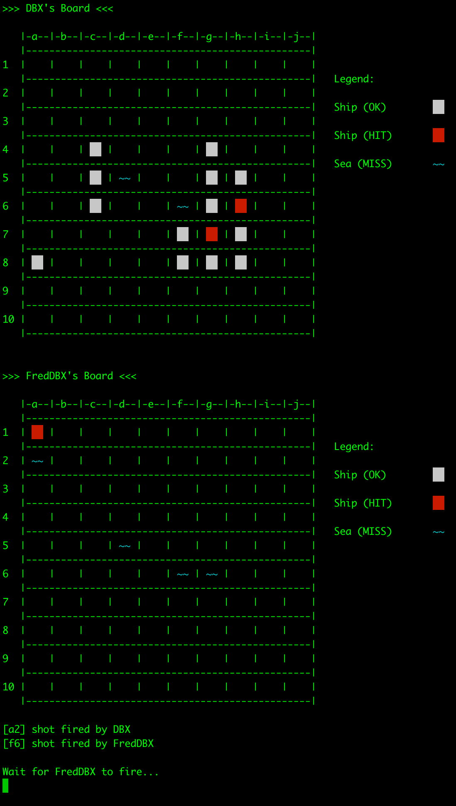

# Go Battleships

A Go battleships implementation with client-server support over network (net/tcp) - 1 / 2 player.

Based on https://github.com/made2591/go-battleship

## Game

Play single player or against a friend over network via TCP.



## Usage

### Server

```
go run main.go -type server -host 192.168.0.5 -port 3333 -ships 5 -vv
```

### Client

```
go run main.go -type client -host 192.168.0.5 -port 3333
```
